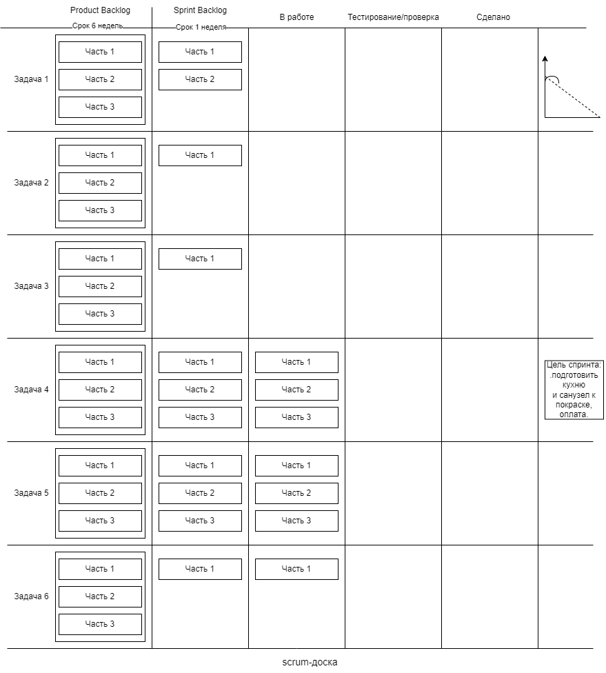

Homework 3. Scrum

Студенты должны решить кейс и прикрепить решение к семинару. Преподаватель проверяет его и даёт обратную связь комментариями. Обсуждение прошлого ДЗ на следующем семинаре не предполагается.

Кейс:
У вас есть трёхкомнатная квартира, в которой не было ремонта последние 20 лет. Вместе с друзьями вы хотите сделать в ней современный ремонт, выстроив работу по Scrum.

Опишите, как вы организуете работу над проектом по фреймворку Scrum.
Сформируйте Product Backlog.
Разделите все работы на спринты.
Сформируйте Sprint Backlog одного любого спринта.
Нарисуйте Scrum-доску и покажите на ней, как организована работа над задачами этого спринта.

_*Ремонт, — это слово, которое наводит ужас и смятение каждому, кто с ним столкнулся
Мы  накопили один миллион рублей, составили смету и поняли, что в принципе вписываемся*_

## Product Backlog:

1. ### Я хочу въехать в эту квартиру через шесть недель!
2. Я хочу чтобы в квартире были сделаны следующие виды работ:

## Задача1 - Ремонт зала:
1. Демонтаж старых полов
2. Замена проводки
3. Замена труб
4. Штукатурка стен
5. Поклейка обоев
6. Заливка полов
7. Замена окна
8. Монтаж натяжных потолков
9. Укладка ламината и монтаж плинтусов
10. Установка дверей

## Задача2 - Ремонт спальни1
1. Демонтаж старых полов
2. Замена проводки
3. Замена труб
4. Штукатурка стен
5. Поклейка обоев
6. Заливка полов
7. Замена окна
8. Монтаж натяжных потолков
9. Укладка ламината и монтаж плинтусов
10. Установка дверей
 
## Задача3 - Ремонт спальни2
1. Демонтаж старых полов
2. Замена проводки
3. Замена труб
4. Штукатурка стен
5. Поклейка обоев
6. Заливка полов
7. Замена окна
8. Монтаж натяжных потолков
9. Укладка ламината и монтаж плинтусов
10. Установка дверей

## Задача4 - Ремонт кухни 
1. Демонтаж старых полов
2. Замена проводки
3. Замена труб
4. Штукатурка стен
5. Поклейка плитки 
6. Заливка полов
7. Покраска стен
8. Замена окна
9. Монтаж подвесных потолков
10. Укладка ламината и монтаж плинтусов
11. Установка дверей

## Задача5 - Ремонт санузла:
1. Демонтаж старой плитки,
2. Заливка полов и штукатурка стен
3. Поклейка новой плитки
4. Покраска стен
5. Установка унитаза
6. Установка ванны
7. Установка дверей

## Задача6 - Ремонт коридора:
1. Демонтаж старых полов
2. Замена проводки
3. Штукатурка стен
4. Поклейка обоев
5. Заливка полов
6. Монтаж натяжных потолков
7. Укладка ламината и монтаж плинтусов
8. Установка дверей

Как уложиться в сроки и разумный бюджет? Можно ли в данной ситуации применить гибкую модель управления проектами?
Мы решили что хуже не будет, и решились на этот эксперимент.

Мы с друзьями описали свои хотелки,  как будет выглядеть каждый уголок нашей будущей квартиры.

Друзья нарисовали проект комнат, кухни и прихожей.

Поскольку я и мои друзья далеки от ремонта и строительства, мы решили нанять рабочих.

Поиск рабочих проводили по принципу - что умеет?

Я поставил себе задачу найти трех рабочих с универсальными навыками, в состав скилов которых входили бы все возможные виды работ, которые нужно выполнить в ходе ремонта
Так же обязательным условием было наличие автомобиля у одного из рабочих, чтобы они могли самостоятельно докупать материалы и не тревожить меня по пустякам.

Всех троих кандидатов собрали вечером в квартире и я рассказал им что работать они будут спринтами по цветным стикам.

На старой обоине я нарисовал таблицу из трех граф, на которой написал: "бэклог", "в работе" и "сделано".

На разноцветных квадратных стиках были написаны наши хотелки, которые я приклеил в графу бэклог.
Далее на скотч приклеил обоину к стене и вкратце рассказал про подход скрам.

И сказал рабочим - ребята, через шесть недель я хочу въехать в эту квартиру.

На наше удивление все трое явились на следующий день утром, в назначенное время.

Я указал на зеленый стик с хотелкой - я хочу въехать в квартиру через шесть недель и задал вопрос:

Что мы должны для этого сделать?

Ребята несколько отошли от вчерашнего шока и сказали, что логичнее сделать кухню и санузел

Работа закипела.

Каждое утро я задавал вопросы:
Что сделали вчера, перемещая карточки в графу "Сделано"
Что мешает работе?
Что делаем сегодня?

При этом рабочие сами двигали карточки из бэклога в графу "В работе"

Я спрашивал рабочих, как сделать нашу работу быстрее?

В выходные дни я помогал рабочим.
Такими темпами через неделю была завершена работа на кухне и в санузле.
Через четыре недели зал и спальня были закрыты плотно полиэтиленом, чтобы пыль не могла проникнуть в уже готовые помещения.
А уже через пять недель я прикручивал унитаз в санузле.
Унитаз установлен, жить можно.
Обоина со стиками , изрядно потрепанная, в ходе ремонта лежала в коридоре, и правая ее сторона, графа "Сделано", была увешана цветными стиками

Вечером рабочие заканчивали установку двери, а я подчитывал бюджет.

Такого не может быть! А за счет чего?

Главным образом за счет того, что я не платил за переделки, которых попросту не было.

Скрам помогает организовать работу.
Рабочие обсуждали, как они могут помочь друг другу работать быстрее. Нехватка материалов обнаруживалась до того, как их отсутствие замедляло процесс. 

Самым главным плюсом ежедневных собраний стало то, что они освободили рабочих от зависимости. Насколько я знаю, в любом строительном проекте большое количество времени тратится на ожидание, когда будет завершена одна часть работы.

Фреймворк Scrum сработал. Через шесть недель работы были закончены.

Scrum-board: 